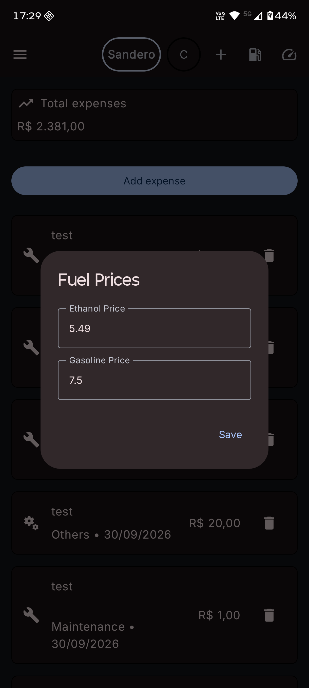
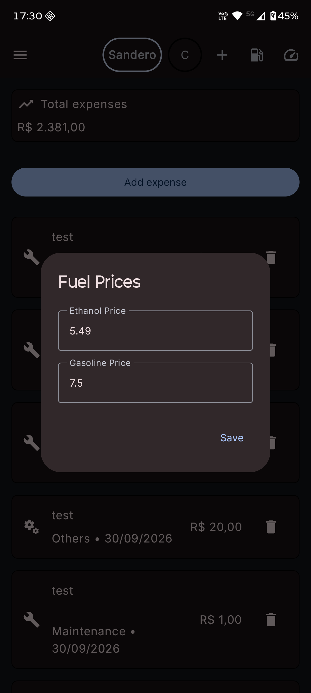

# Car Costs Management

An Android application for tracking vehicle expenses, fuel prices, and maintenance schedules.

## Features

- **Vehicle Management**: Support for multiple vehicles.
- **Expense Tracking**: Log fuel, maintenance, and other costs, including recurring expenses.
- **Maintenance Alerts**: Oil change reminders based on vehicle mileage.
- **Fuel Prices**: Track ethanol and gasoline prices for cost comparison.
- **Offline Storage**: Local data persistence using Room.
- **Pagination**: Efficient loading for long expense histories.

## Screenshots

| Dashboard | Fuel Prices | Car Listing |
| :---: | :---: | :---: |
|  |  |  |

## Tech Stack

- **UI**: Jetpack Compose and Material 3.
- **Logic/Concurrency**: Kotlin Coroutines and Flow.
- **Dependency Injection**: Koin.
- **Persistence**: Room Database and DataStore.
- **Pagination**: Paging 3.
- **Background Tasks**: WorkManager for recurring expense scheduling.
- **Testing**: MockK, Turbine, and Jacoco for coverage.

## Architecture

The project follows a standard MVVM/MVI approach with a clear separation between the UI and data layers:

- **UI Layer**: Compose functions observing state from ViewModels via StateFlow.
- **Data Layer**: Repositories managing Room database operations and shared preferences.

## Getting Started

### Prerequisites
- Android Studio Koala or newer.
- JDK 21.
- Android SDK 35.

### Installation
1. Clone the repository.
2. Open in Android Studio.
3. Sync Gradle and run the `:app` module.

## Testing

Run unit tests:
```bash
./gradlew test
```

Generate code coverage report:
```bash
./gradlew jacocoTestReport
```

## License
MIT License.
